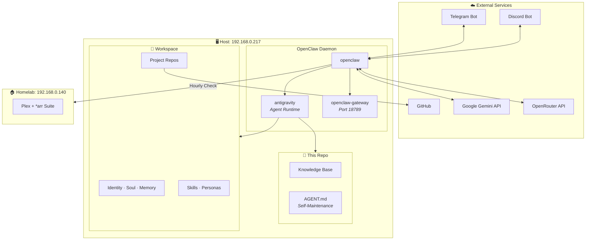

> [!WARNING]
> **❄️ FROZEN 2026-07-17.** This knowledge base documented the OpenClaw era and is superseded by
> **[JarvisVault](https://github.com/jcriecken/JarvisVault)** — an Obsidian vault at
> `~/.openclaw/workspace/vault/` with Hermes-current docs. This repo remains for history only.
> Do not update; new knowledge goes to the vault.

<div align="center">

# 🧠 OpenClaw Brain — Jarvis Instance

**The central knowledge base for the OpenClaw "Jarvis" AI agent running on `192.168.0.217`.**

[](.)
[](.)
[](.)

</div>

---

This repository is an **AI-readable knowledge base** documenting the complete operational surface of the OpenClaw "Jarvis" instance — architecture, configuration, projects, skills, personas, cron jobs, integrations, and maintenance runbooks.

Every file follows a **Dewey Decimal naming convention** with YAML frontmatter for machine readability, mirroring the structure of the [documenationHub](https://github.com/jcriecken/documenationHub).

> [!TIP]
> This repo is designed to be **cloned into the OpenClaw workspace** and kept in sync so Jarvis can reference it. See [AGENT.md](./AGENT.md) for the self-maintenance protocol.

---

## 📚 Knowledge Base Index

| ID | Category | Document | Focus |
| :--- | :--- | :--- | :--- |
| `00` | Meta | [**00-Index**](./docs/00-Index.md) | Master index, file registry, system conventions |
| `10` | Architecture | [**10-Architecture**](./docs/10-Architecture.md) | Processes, network topology, LLM provider chain |
| `11` | Architecture | [**11-Configuration**](./docs/11-Configuration.md) | `openclaw.json` complete reference |
| `12` | Architecture | [**12-Workspace**](./docs/12-Workspace.md) | Workspace directory layout and file responsibilities |
| `20` | Projects | [**20-Projects**](./docs/20-Projects.md) | All web apps, repos, tech stacks, infrastructure |
| `30` | Agent | [**30-Skills**](./docs/30-Skills.md) | Skill system, current skills, creation guide |
| `31` | Agent | [**31-Personas**](./docs/31-Personas.md) | Persona model, soul files, agent registry |
| `40` | Operations | [**40-Cron-Automation**](./docs/40-Cron-Automation.md) | Scheduled jobs, delivery modes, monitoring |
| `41` | Operations | [**41-Plugins-Integrations**](./docs/41-Plugins-Integrations.md) | Telegram, Discord, browser automation |
| `50` | Runbooks | [**50-Maintenance**](./docs/50-Maintenance.md) | Health checks, backups, cleanup procedures |
| `51` | Runbooks | [**51-Troubleshooting**](./docs/51-Troubleshooting.md) | Diagnostics, common issues, emergency recovery |
| — | Agent | [**AGENT.md**](./AGENT.md) | Self-maintenance protocol for Jarvis |

---

## 🏗️ Architecture at a Glance



---

## 🚀 Application Portfolio

| Application | Domain | Stack | Status |
| :--- | :--- | :--- | :--- |
| **feierlich** | [`feierlich.ai`](https://feierlich.ai) (+ alias `.app`) | Next.js 16, Firebase Hosting + Cloud Run SSR | ✅ Live (top priority) |
| **JC Development** | [`jc-development.com`](https://www.jc-development.com) | Next.js 16, Tailwind v4, Firebase | ✅ Live |
| **Villa Ines** | [`villa-ines-mallorca.com`](https://villa-ines-mallorca.web.app) | HTML5, CSS3, Vanilla JS | ✅ Live |
| **DeChava** | [`dechava.com`](https://dechava.com) | Static HTML/CSS | ✅ Live |
| **Whisper SOTA** | *(local desktop)* | Python, CUDA, PyQt6 | ✅ Active |

See [**20-Projects**](./docs/20-Projects.md) for full deep dives.

---

## ⚡ Quick Start for New Operators

```bash
# 1. SSH into the host
ssh skilla@192.168.0.217

# 2. Check if OpenClaw is running
ps aux | grep -E 'openclaw|antigravity' | grep -v grep

# 3. Read the agent's current state
cat ~/.openclaw/workspace/MEMORY.md
cat ~/.openclaw/workspace/CRON_STATUS.txt

# 4. Pull this knowledge base into the workspace
cd ~/.openclaw/workspace
git clone https://github.com/jcriecken/OpenClawBrain.git _brain
```

<details>
<summary><b>🔑 Key File Locations</b></summary>

| What | Where |
|:---|:---|
| Main Config | `~/.openclaw/openclaw.json` |
| Agent Identity | `~/.openclaw/workspace/IDENTITY.md` |
| Agent Personality | `~/.openclaw/workspace/SOUL.md` |
| Agent Memory | `~/.openclaw/workspace/MEMORY.md` |
| Credentials | `~/.openclaw/workspace/credentials.env` |
| Cron Jobs | `~/.openclaw/cron/jobs.json` |
| Persistent Memory | `~/.openclaw/memory/main.sqlite` |
| This Knowledge Base | `~/.openclaw/workspace/_brain/` |

</details>

---

## 🔄 Keeping This Repo Updated

This knowledge base is **enriched over time** — either manually or by Jarvis following the [AGENT.md](./AGENT.md) protocol. The agent can detect undocumented config changes (from Discord commands, manual edits, etc.) and commit updates.

See [AGENT.md](./AGENT.md) for the full self-maintenance protocol.

---

## 📎 Related Repositories

| Repository | Description |
|:---|:---|
| [`documenationHub`](https://github.com/jcriecken/documenationHub) | Central dev portfolio knowledge base (Dewey Decimal index) |
| [`jc-development`](https://github.com/jcriecken/jc-development) | Primary Next.js dashboard |
| [`Villa2`](https://github.com/jcriecken/Villa2) | Villa Ines Mallorca website |
| [`DeChava`](https://github.com/jcriecken/DeChava) | Interpreting services website |
| [`JCJarvisMain`](https://github.com/jcriecken/JCJarvisMain) | OpenClaw workspace (git-tracked state) |

---

<div align="center">
<sub>Maintained by Carlos & Jarvis 🤓 · Powered by OpenClaw</sub>
</div>
