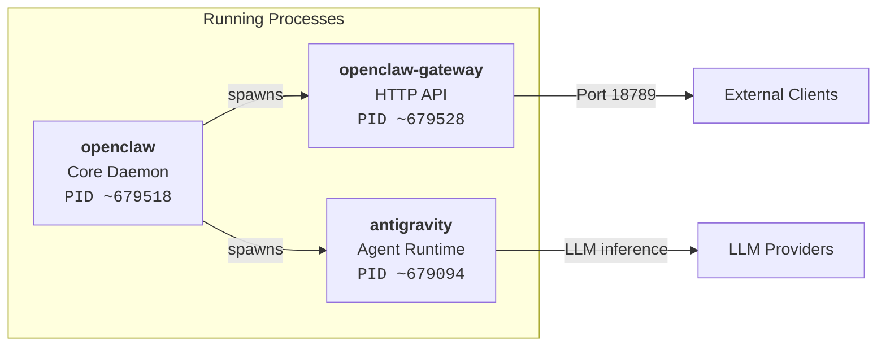
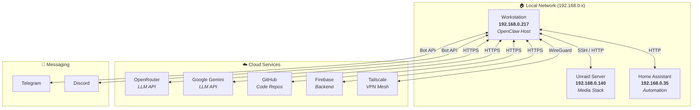
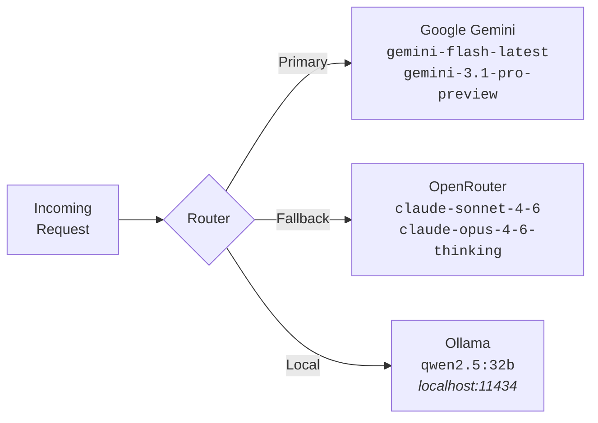
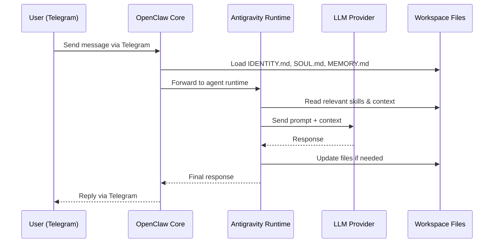

# 🏗️ Architecture

> System architecture for the OpenClaw "Jarvis" instance on `192.168.0.217`.

---

## Process Model

OpenClaw runs as **three cooperating processes** on the host:



| Process | Role | Port | Notes |
|:---|:---|:---|:---|
| `openclaw` | Core daemon — manages lifecycle, plugins, cron | — | Parent process |
| `openclaw-gateway` | HTTP/WebSocket API for external access | `18789` | Token-authenticated |
| `antigravity` | Google DeepMind agent runtime for reasoning | — | Launched by OpenClaw |

---

## Network Topology



---

## Directory Architecture

OpenClaw uses a **two-tier directory model**:

### Tier 1: System Config (`~/.openclaw/`)

This directory is **managed by the OpenClaw daemon**. Do not manually edit files here unless you know what you're doing.

```
~/.openclaw/
├── openclaw.json              # 🔧 Master configuration file
├── agents/
│   └── main/
│       ├── agent/
│       │   ├── models.json        # LLM model definitions
│       │   └── auth-profiles.json # API key profiles
│       └── sessions/              # Conversation session logs (.jsonl)
├── skills/                    # 🧰 Custom skill definitions
│   ├── jc-development/
│   └── ui-ux-master/
├── cron/                      # ⏰ Scheduled jobs
│   ├── jobs.json
│   └── runs/                  # Execution logs
├── memory/
│   └── main.sqlite            # 🧠 Persistent memory database
├── browser/                   # 🌐 Playwright browser config
├── telegram/                  # 📱 Telegram bot state
├── delivery-queue/            # 📬 Outbound message queue
├── credentials/               # 🔐 Auth credentials
├── subagents/                 # 🤖 Subagent execution tracking
└── logs/                      # 📋 System logs
```

> [!WARNING]
> The `agents/main/sessions/` directory grows over time with conversation logs. Monitor disk usage periodically.

### Tier 2: Workspace (`~/.openclaw/workspace/`)

This is the **agent's working directory** — files here are read and written by Jarvis during conversations. This directory is also a **git repository** (`JCJarvisMain`).

```
~/.openclaw/workspace/
├── IDENTITY.md                # Who Jarvis is
├── SOUL.md                    # How Jarvis behaves
├── MEMORY.md                  # What Jarvis remembers about users
├── AGENTS.md                  # Persona registry
├── TOOLS.md                   # Homelab & dev stack reference
├── HEARTBEAT.md               # Health check task list
├── CRON_UPDATES.md            # Hourly status log
├── CRON_STATUS.txt            # Latest cron result
├── credentials.env            # API keys (gitignored)
├── personas/                  # Sub-persona soul files
│   ├── architect/SOUL.md
│   └── media/SOUL.md
├── skills/                    # Workspace-level skill overrides
├── scripts/                   # Utility scripts
├── repo-jc-development/       # JC Development (Next.js) repo
├── repo-documentation-hub/    # Documentation repo
└── ...
```

> [!NOTE]
> The workspace is where **you as a maintainer** will spend most of your time. See [Workspace Guide](workspace.md) for full details.

---

## LLM Provider Chain

Jarvis has access to multiple LLM providers, configured in a **fallback chain**:



| Provider | Models | Auth |
|:---|:---|:---|
| Google Gemini | `gemini-flash-latest`, `gemini-3.1-pro-preview`, `gemini-3-flash-preview`, `gemini-3-pro-preview` | API Key |
| OpenRouter (Anthropic) | `claude-sonnet-4-6`, `claude-opus-4-6-thinking` | API Key |
| Ollama (Local) | `qwen2.5:32b` | None (localhost) |

> [!TIP]
> Ollama runs locally on the same machine. It serves the `qwen2.5:32b` model for tasks that don't require cloud inference. Useful for privacy-sensitive operations.

---

## Authentication & Security

### Gateway Authentication

The gateway runs in **local mode** with **token-based authentication**:

```json
{
  "gateway": {
    "port": 18789,
    "mode": "local",
    "bind": "auto",
    "auth": {
      "mode": "token",
      "token": "<configured-token>"
    }
  }
}
```

### Command Deny List

The following commands are **blocked** from external node execution:

| Denied Command | Reason |
|:---|:---|
| `camera.snap` | Privacy |
| `camera.clip` | Privacy |
| `screen.record` | Privacy |
| `calendar.add` | Safety |
| `contacts.add` | Safety |
| `reminders.add` | Safety |

### Tailscale

Tailscale is **configured but disabled** (`"mode": "off"`). It can be re-enabled for remote access through the VPN mesh network.

---

## Data Flow: A Typical Interaction


