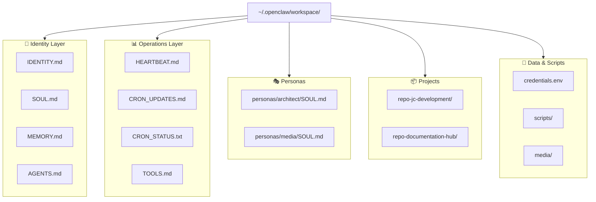

# 📁 Workspace Guide

> Everything about `~/.openclaw/workspace/` — the agent's working directory and operational home base.

---

## What is the Workspace?

The workspace is where Jarvis **lives and works**. It's a git-tracked directory that contains:
- The agent's identity and personality files
- Project repositories
- Operational logs and status files
- Utility scripts and data exports

> [!TIP]
> **Git Remote:** `https://github.com/jcriecken/JCJarvisMain.git` (branch: `main`)
> 
> The workspace is version-controlled so changes can be tracked, rolled back, and synced.

---

## Directory Map



---

## File Reference

### 🪪 Identity Files

These files define **who Jarvis is**. They are loaded at the start of every conversation.

| File | Purpose | Edit Frequency |
|:---|:---|:---|
| `IDENTITY.md` | Name, role, emoji, avatar | Rarely |
| `SOUL.md` | Personality, values, behavioral rules | Occasionally |
| `MEMORY.md` | User profile, preferences, interaction history | Frequently (by Jarvis) |
| `AGENTS.md` | Registry of all personas and their triggers | When adding personas |

<details>
<summary><b>IDENTITY.md Structure</b></summary>

```markdown
# IDENTITY.md - Who Am I?

- **Name:** Jarvis
- **Creature:** AI Assistant
- **Vibe:** Technical, proactive, and concise.
- **Emoji:** 🤓
- **Avatar:** (optional image URL)
```

Key rules:
- The `Name` is how the agent refers to itself
- The `Vibe` sets the conversational tone
- The `Emoji` is used in message reactions

</details>

<details>
<summary><b>SOUL.md Structure</b></summary>

```markdown
# SOUL.md - Who You Are

## Core Truths
- Be genuinely helpful, not performatively helpful
- Skip the "Great question!" — just answer
- If you change this file, tell the user — it's your soul

## Behavioral Rules
- When in doubt, ask before acting externally
- You're not the user's voice — be careful in group chats
- These files ARE your memory. Read them. Update them.
```

> [!IMPORTANT]
> The SOUL.md is designed to be **self-modifiable** by the agent. If Jarvis updates its own SOUL.md, it must announce the change.

</details>

<details>
<summary><b>MEMORY.md Structure</b></summary>

```markdown
# MEMORY.md

## Profile: Carlos
- **Location:** Bonn, Germany
- **Communication:** Prefers concise, direct interactions
- **Mindset:** Wants a proactive PO-style assistant

## Timeline
- 2025-05-21: Initial setup — established "Jarvis" persona
- 2026-02-16: Adopted "JC Development" blueprint
```

This file is **actively maintained by Jarvis**. Each session, the agent reads it for context and may append new learnings.

</details>

---

### 📊 Operations Files

These files are used for **monitoring and status tracking**.

| File | Purpose | Updated By |
|:---|:---|:---|
| `HEARTBEAT.md` | Checklist of health tasks | Cron job |
| `CRON_UPDATES.md` | Hourly status log with timestamps | Cron job |
| `CRON_STATUS.txt` | Latest cron run result (1-2 lines) | Cron job |
| `TOOLS.md` | Reference sheet for homelab hardware & dev stack | Maintainer |

> [!WARNING]
> `CRON_UPDATES.md` grows over time (currently ~25KB). Consider periodic truncation — keep the last 50-100 entries and archive the rest.

**Truncation command:**
```bash
tail -100 ~/.openclaw/workspace/CRON_UPDATES.md > /tmp/cron_trimmed.md
mv /tmp/cron_trimmed.md ~/.openclaw/workspace/CRON_UPDATES.md
```

---

### 🎭 Personas

Persona soul files live in `personas/<name>/SOUL.md`. Each defines a specialized sub-personality.

| Persona | Role | Trigger |
|:---|:---|:---|
| `architect` | Senior Full-Stack Architect & Product Owner | Development tasks |
| `media` | Media Server Guardian & Content Curator | Plex/media tasks |

See [Personas](personas.md) for details on creating new personas.

---

### 📦 Project Repositories

Active development projects cloned into the workspace:

| Directory | Project | Stack |
|:---|:---|:---|
| `repo-jc-development/` | JC Development website | Next.js 16, Tailwind v4, Firebase |
| `repo-documentation-hub/` | Documentation hub | Markdown |

These are full git repositories with their own remotes. They are synced via the `sync-repos.sh` script.

---

### 💾 Credentials & Secrets

| File | Contents | Git Status |
|:---|:---|:---|
| `credentials.env` | Telegram token, Discord token, GitHub PAT, Gemini API key | **Gitignored** ✅ |
| `gcp-key.json` | GCP service account key | **Gitignored** ✅ |
| `SECRETS.md` | Reference/index of where secrets are stored | Tracked |

> [!CAUTION]
> Never commit `credentials.env` or `gcp-key.json`. They are in `.gitignore` but always verify before pushing.

---

## `.gitignore`

Current gitignore rules for the workspace:

```
credentials.env
memory/
node_modules/
fileflows-node/
.venv/
gcp-key.json
```

---

## Git Workflow

```bash
# Check status
cd ~/.openclaw/workspace
git status

# Sync repos (pulls all sub-repos)
bash ~/.openclaw/skills/jc-development/scripts/sync-repos.sh

# Commit workspace changes
git add -A
git commit -m "Update workspace state"
git push origin main
```
