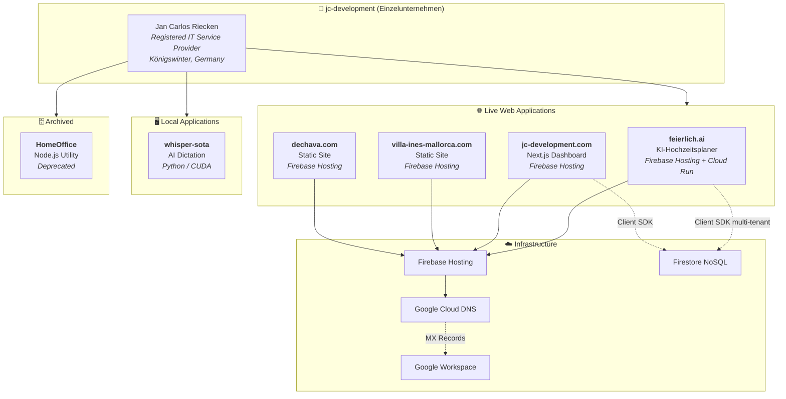
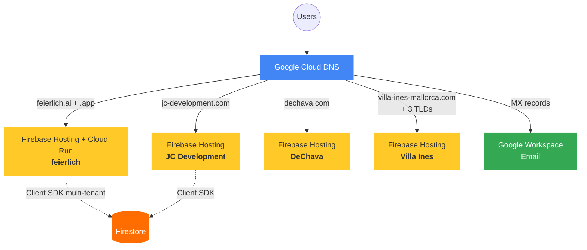

# 🚀 Development Projects

> Complete registry of all active development projects managed through the OpenClaw ecosystem, sourced from the [documenationHub](https://github.com/jcriecken/documenationHub).

---

## Ecosystem Overview

> **Owner:** Jan Carlos Riecken (`jcriecken`) — SAP consultant by day, JC Development as side hustle.
> **Revenue:** < €100/month currently. Goal: ~$6,000/year.
> **Boundaries:** DeChava and Villa Ines are family projects (mother: Inés de Chavarría) — agent is hands-off.



---

## Project Registry

### §0. feierlich.ai — KI-Hochzeitsplaner *(top priority)*

| Field | Value |
|:---|:---|
| **Repository** | local `/home/skilla/DEV/feierlich/` (GitHub remote as used by Carlos/Jan) |
| **Canonical domain** | [`feierlich.ai`](https://feierlich.ai) — **since 2026-07-12** |
| **Alias** | [`feierlich.app`](https://feierlich.app) — remains live, **no 301 yet** (same Hosting site) |
| **Registrar `.ai`** | Squarespace Domains (~72 €/yr, 2-year min; Cloud Domains does **not** support `.ai`) |
| **Registrar `.app`** | Google Cloud Domains (Reseller Squarespace), ~14 $/yr |
| **DNS** | Cloud DNS zones `feierlich-ai` + `feierlich-app` → A `199.36.158.100` + Hosting TXT |
| **Hosting** | Firebase Hosting Web Frameworks → Cloud Run SSR (`europe-west1`), site `feierlich`, project `feierlich-01` |
| **Auth** | Firebase Auth Google Sign-In; `authDomain=feierlich.ai` |
| **Status** | ✅ Live (Wedding-OS track, board in repo `docs/PROGRESS.md`) |

Agent role (since 2026-06-29 / 2026-07-01): **PO only** — backlog/findings/docs/push, **no application code**. Implementation by Jan (Claude Code / Opus). Deploy ops allowed: `firebase deploy --only hosting:feierlich --project feierlich-01 --force`.

Canonical runbook: repo `CLAUDE.md` + Hermes skill `feierlich`.

---

### §1. JC Development — Primary Dashboard

| Field | Value |
|:---|:---|
| **Repository** | [`jcriecken/jc-development`](https://github.com/jcriecken/jc-development) |
| **Domain** | [`www.jc-development.com`](https://www.jc-development.com) |
| **Hosting** | Firebase Hosting (Edge CDN) |
| **DNS** | Google Cloud DNS |
| **Status** | ✅ Live |

<details>
<summary><b>Tech Stack</b></summary>

| Layer | Technology |
|:---|:---|
| Framework | Next.js v16.1.6 / React v19.2.3 |
| Styling | Tailwind CSS v4, Framer Motion |
| Mapping | Leaflet, React-Leaflet, Leaflet-Routing-Machine |
| 3D | Three.js, `@react-three/fiber`, `@react-three/drei` |
| Backend | Firebase SDK 12.8.0, Firestore NoSQL |
| Deployment | Static Next.js Edge CDN export |
| Icons | Lucide React |
| Drag & Drop | `@dnd-kit/core`, `@dnd-kit/sortable` |
| Markdown | `markdown-it` |

</details>

<details>
<summary><b>Modules</b></summary>

| Module | Description |
|:---|:---|
| **Authentication** | Static access code mechanism |
| **Road Trip Planner** | Leaflet-powered geospatial routing for the Iberian Peninsula |
| **Mission Equipment** | Inventory manifest and cargo weight tracker |
| **Sandbox (Age of War)** | React state management experiment |
| **BG Eraser** *(planned)* | Client-side WebAssembly background removal (`@imgly/background-removal`) |

</details>

<details>
<summary><b>App Router Structure</b></summary>

```
app/
├── (app)/                  # Authenticated app routes
├── (marketing)/            # Public marketing pages
├── favicon.ico
├── globals.css
└── layout.js
```

</details>

**OpenClaw Workspace Path:** `~/.openclaw/workspace/repo-jc-development/`

---

### §2. Villa Ines Mallorca — Vacation Rental

| Field | Value |
|:---|:---|
| **Repository** | [`jcriecken/Villa2`](https://github.com/jcriecken/Villa2) |
| **Domains** | `villa-ines-mallorca.com`, `villaines.net`, `villaines.de`, `villa-ines-mallorca.net` |
| **Hosting** | Firebase Hosting (Edge CDN) |
| **DNS** | Google Cloud DNS |
| **Preview** | [`villa-ines-mallorca.web.app`](https://villa-ines-mallorca.web.app) |
| **Status** | ✅ Live |

<details>
<summary><b>Tech Stack</b></summary>

| Layer | Technology |
|:---|:---|
| Architecture | Pure HTML5, CSS3, Vanilla JavaScript (no bundler/SPA) |
| Structure | Modular pages (`index.html`, `gallery.html`, `activities.html`, `buchung.html`) |
| Media Pipeline | Custom PowerShell scripts (`Compress-Images.ps1`, `Generate-Previews.ps1`) |

</details>

<details>
<summary><b>Modules</b></summary>

| Module | Description |
|:---|:---|
| **Hero & Overview** | High-resolution Mediterranean estate imagery |
| **Gallery & Activities** | Dynamic sliders and local area recommendations |
| **Booking / Contact** | Availability inquiry forms |

</details>

> [!NOTE]
> This site was migrated from AWS Amplify/CloudFront to Firebase Hosting in March 2026. See the [Migration Log](https://github.com/jcriecken/documenationHub/blob/master/docs/90-Migration-Log.md).

---

### §3. Inés de Chavarría (DeChava) — Interpreting Services

| Field | Value |
|:---|:---|
| **Repository** | [`jcriecken/DeChava`](https://github.com/jcriecken/DeChava) |
| **Domain** | [`dechava.com`](https://dechava.com) |
| **Hosting** | Firebase Hosting |
| **DNS** | Google Cloud DNS |
| **Status** | ✅ Live |

<details>
<summary><b>Tech Stack</b></summary>

| Layer | Technology |
|:---|:---|
| Architecture | Static HTML/CSS |
| Structure | Minimalistic multi-page hybrid (`index.html`, `impressum.html`) |

</details>

<details>
<summary><b>Modules</b></summary>

| Module | Description |
|:---|:---|
| **Services** | Simultaneous, Remote, and Consecutive interpreting |
| **About & Accreditations** | AIIC, VKD/BDÜ memberships, EU institution accreditations |

</details>

---

### §4. HomeOffice Utility — *Deprecated*

| Field | Value |
|:---|:---|
| **Repository** | [`jcriecken/HomeOffice`](https://github.com/jcriecken/HomeOffice) |
| **Status** | 🔴 Deprecated |

Legacy Node.js utility using `jimp` (image processing) and `exifr` (EXIF data). Retained for historical context.

> [!WARNING]
> This project is deprecated. Consider archiving the GitHub repository.

---

### §5. Whisper SOTA — Local AI Dictation

| Field | Value |
|:---|:---|
| **Repository** | *(Not yet published to GitHub)* |
| **Domains** | N/A — Desktop application |
| **Status** | ✅ Active (local development) |

<details>
<summary><b>Tech Stack</b></summary>

| Layer | Technology |
|:---|:---|
| Runtime | Python 3.x with CUDA |
| AI Engine | CTranslate2 / faster-whisper |
| GPU | NVIDIA RTX 5090 (zero-latency, fully offline) |
| UI | PyQt6 system tray application |
| Build | PyInstaller (portable `.exe`) |

</details>

<details>
<summary><b>Features</b></summary>

| Feature | Description |
|:---|:---|
| **Push-to-Talk** | Global hotkey triggers real-time transcription |
| **Settings GUI** | PyQt6 tray app for mic selection, hotkey binding, audio monitoring |
| **Discord Hook** | Toggle for Discord integration |
| **Transcript Logging** | Daily files with inline `▶ Play Audio` hyperlinks |
| **Portable Build** | `build_exe.py` + `WhisperDictation.spec` → self-contained `.exe` |

</details>

> [!IMPORTANT]
> The key engineering breakthrough was isolating the CTranslate2/CUDA engine from the PyQt6 UI thread to eliminate a Windows-specific deadlock.

---

## Repository Map

All projects use a **Sibling Workspace Architecture** — cloned side-by-side:

```
# Developer Workstation (C:\dev\)             # OpenClaw Workspace (~/.openclaw/workspace/)
┌──────────────────────────────────┐          ┌──────────────────────────────────────┐
│ C:\dev\                          │          │ ~/.openclaw/workspace/               │
│ ├── documenationHub/        📚   │          │ ├── repo-jc-development/        📦   │
│ ├── jc-development/         📦   │          │ ├── repo-documentation-hub/     📚   │
│ ├── Villa2/                 🏖️   │          │ └── (other workspace files)          │
│ ├── DeChava/                🎙️   │          └──────────────────────────────────────┘
│ ├── whisper-sota/           🎤   │
│ └── HomeOffice/             🗄️   │
└──────────────────────────────────┘
```

---

## Infrastructure Stack

All live web applications share a unified infrastructure:



| Service | Provider | Details |
|:---|:---|:---|
| **DNS** | Google Cloud DNS | Authoritative for listed domains (incl. `feierlich-ai`, `feierlich-app`) |
| **Hosting** | Firebase Hosting (+ Cloud Run SSR for feierlich) | Edge CDN / SSR for next apps |
| **Database** | Firestore | NoSQL; jc-development + multi-tenant feierlich |
| **Email** | Google Workspace | MX routing via Cloud DNS |
| **Domain Registration** | Mixed | AWS Route 53 (legacy Villa Ines registrar); Cloud Domains (feierlich.app); **Squarespace Domains (feierlich.ai)** |

> [!NOTE]
> AWS infrastructure was fully migrated to GCP/Firebase in March 2026. AWS is retained **only as the domain registrar** for the Villa Ines domains. See the [Migration Log](https://github.com/jcriecken/documenationHub/blob/master/docs/90-Migration-Log.md) for details.

---

## Documentation Hub Cross-References

The central documentation lives in [`jcriecken/documenationHub`](https://github.com/jcriecken/documenationHub) and uses a **Dewey Decimal naming system**:

| ID | Document | Description |
|:---|:---|:---|
| `00` | [Index](https://github.com/jcriecken/documenationHub/blob/master/docs/00-Index.md) | Master index and file registry |
| `10` | [Infrastructure Stack](https://github.com/jcriecken/documenationHub/blob/master/docs/10-Infrastructure-Stack.md) | Cloud hosting, DNS, Firebase, AWS |
| `20` | [Business Registration](https://github.com/jcriecken/documenationHub/blob/master/docs/20-Business-Registration.md) | Legal status, addresses, scope |
| `21` | [Portfolio Projects](https://github.com/jcriecken/documenationHub/blob/master/docs/21-Portfolio-Projects.md) | App deep dives (this page's source) |
| `30` | [Agent Skills](https://github.com/jcriecken/documenationHub/blob/master/docs/30-Agent-Skills.md) | AI agent skill registry |
| `31A–I` | [UI/UX Design System](https://github.com/jcriecken/documenationHub/blob/master/docs/31A-UIUX-Design-System.md) | Design intelligence suite (9 files) |
| `32A–C` | [Browser Testing](https://github.com/jcriecken/documenationHub/blob/master/docs/32A-Test-Light.md) | Testing skill group (3 files) |
| `80` | [Ideas Incubator](https://github.com/jcriecken/documenationHub/blob/master/docs/80-Ideas-Incubator.md) | Feature tracker and workspace setup |
| `90` | [Migration Log](https://github.com/jcriecken/documenationHub/blob/master/docs/90-Migration-Log.md) | AWS → GCP migration history |

---

## Open TODOs

- [ ] Publish `whisper-sota` to GitHub and add repo link
- [ ] Add BG Eraser module entry under §1 once shipped
- [ ] Evaluate archiving the `HomeOffice` repository
- [ ] Determine if `dechava.com` needs Google Workspace MX routing
