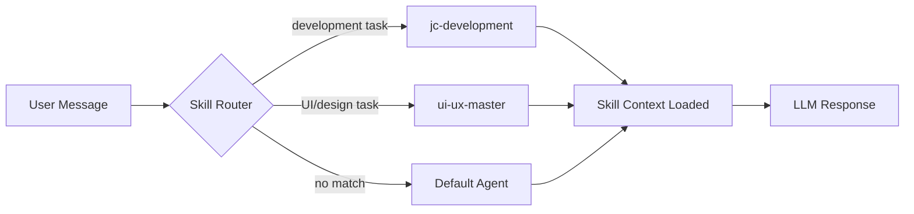

# 🧰 Skills System

> How skills work, their file structure, and how to create new ones.

## ⚠ Skill location update (2026-05-26)

OpenClaw now runs on **Hermes Agent**, whose canonical skill directory is
`~/.hermes/skills/<category>/<skill-name>/`. The legacy `~/.openclaw/skills/`
path described in the rest of this doc is **historic** — keep it for context
on how the system evolved, but new skills go under `~/.hermes/skills/`.

Manage with the `skill_manage` tool inside Hermes sessions, or:

```bash
hermes skills list
hermes skills install <plugin>
```

### Active Hermes skills owned by this workspace

| Skill | Category | Purpose |
|:---|:---|:---|
| `jc-development-blueprint` | software-development | Stack scaffold for Carlos's Next 16 / Tailwind v4 / Firebase apps. Includes `scaffold.sh`, `AuthGuard.tsx`, `firebase.ts`, `layout.tsx`, `firestore-patterns.md`. Replaces the ~1.2KB blueprint block that used to live in memory. |
| `git-sync-openclaw` | devops | One-shot end-of-session sync: stage/commit/push both `JCJarvisMain` (workspace) and `OpenClawBrain` (_brain). Wraps the AGENTS.md checklist. Run: `bash ~/.hermes/skills/devops/git-sync-openclaw/scripts/sync.sh "<summary>"`. |

(The full skill library — hundreds of installed Hermes skills — is listed by
`hermes skills list`. This table only tracks ones authored for this workspace.)

---

## What are Skills?

Skills are **self-contained instruction packages** that give Jarvis specialized knowledge and behaviors. When a user request matches a skill's trigger, OpenClaw loads the skill's context files into the agent's prompt.



---

## Skill Locations

OpenClaw sources skills from **two locations**:

| Location | Path | Purpose |
|:---|:---|:---|
| **System Skills** | `~/.openclaw/skills/` | Primary skill definitions (read at boot) |
| **Workspace Skills** | `~/.openclaw/workspace/skills/` | Workspace-local overrides |

> [!TIP]
> System skills in `~/.openclaw/skills/` are the canonical location. Workspace skills are useful for project-specific overrides.

---

## Skill File Structure

Every skill **must** have a `SKILL.md` file. Additional resources are optional:

```
~/.openclaw/skills/<skill-name>/
├── SKILL.md                    # Required — main instructions
├── references/                 # Optional — context documents
│   ├── architecture.md
│   ├── repos.md
│   └── services.md
└── scripts/                    # Optional — automation scripts
    └── sync-repos.sh
```

### `SKILL.md` Format

```markdown
---
name: skill-name
description: >
  One-line summary of when to activate this skill.
  Used by the router for trigger matching.
---

## Context
(Background knowledge the agent needs)

## Workflow
(Step-by-step process to follow)

## References
- [Architecture](references/architecture.md)
- [Repos](references/repos.md)

## Rules
(Hard constraints the agent must follow)
```

> [!IMPORTANT]
> The `description` field in YAML frontmatter is **critical** — it's what the skill router uses to decide when to activate the skill. Make it specific.

---

## Current Skills

### `jc-development`

| Property | Value |
|:---|:---|
| **Trigger** | Development tasks for jc-development.com |
| **Role** | Strategic Product Owner and Architect |
| **Stack** | Next.js 16, Tailwind v4, Firestore, Firebase Auth |

**Files:**
| File | Purpose |
|:---|:---|
| `SKILL.md` | Main instructions, workflow, rules |
| `references/architecture.md` | Project blueprint and tech stack |
| `references/repos.md` | Repository context and sync rules |
| `scripts/sync-repos.sh` | Pulls latest from all project repos |

<details>
<summary><b>Key Rules (from SKILL.md)</b></summary>

1. **Reference Check:** Always read the latest "Project State" before starting work
2. **Reflect Changes:** Updates must be reflected on Discord (and Telegram)
3. **Build Validation:** Use the AntiGravity environment for linting and type-checking before reporting completion

</details>

### `ui-ux-master`

| Property | Value |
|:---|:---|
| **Trigger** | UI/UX design tasks |
| **Role** | Advanced UI/UX Architect |
| **Standard** | UI UX Pro Max v2.0 (67 UI styles, 99 UX guidelines) |

**Files:**
| File | Purpose |
|:---|:---|
| `SKILL.md` | Design system rules, workflow, CSS principles |

<details>
<summary><b>Key CSS Principles (from SKILL.md)</b></summary>

| Principle | Rule |
|:---|:---|
| **Motion** | 150–300ms transitions. `ease-out` for entry, `ease-in` for exit |
| **Touch** | Minimum 44×44px targets |
| **Layout** | Standard Z-index scale (10, 20, 30, 50). No `z-9999` |

</details>

---

## Creating a New Skill

### Step 1: Create the Directory

```bash
mkdir -p ~/.openclaw/skills/my-new-skill/references
```

### Step 2: Write the SKILL.md

```bash
cat > ~/.openclaw/skills/my-new-skill/SKILL.md << 'EOF'
---
name: my-new-skill
description: Use when the user asks about <specific topic>.
---

## Context
(What the agent needs to know)

## Workflow
1. Step one
2. Step two
3. Step three

## Rules
- Hard constraint 1
- Hard constraint 2
EOF
```

### Step 3: Add References (Optional)

```bash
cat > ~/.openclaw/skills/my-new-skill/references/guide.md << 'EOF'
---
summary: "Reference guide for my-new-skill"
---

# Guide
(Detailed reference content)
EOF
```

### Step 4: Restart OpenClaw

Skills are loaded at startup. Restart to pick up new skills.

---

## Portable Skills from documenationHub

The [documenationHub](https://github.com/jcriecken/documenationHub) contains an additional **portable skill library** (files `30-Agent-Skills.md`, `31A-31I`, `32A-32C`) designed to be dropped into any project. These are **project-agnostic** and cover:

| Group | Files | Topic |
|:---|:---|:---|
| `31A–31I` | 9 files | UI/UX Design Intelligence (design system, styles, workflow, bootstrap, audit, QA, accessibility, mobile) |
| `32A–32C` | 3 files | Browser Testing & Verification (light, medium, deep) |

See [documenationHub → 30-Agent-Skills](https://github.com/jcriecken/documenationHub/blob/master/docs/30-Agent-Skills.md) for the full skill registry.

---

## Naming Convention for documenationHub Skills

```
[Group Number][Sub-Letter]-[Name].md
──────────────────────────────────
Examples:
  30-Agent-Skills.md       ← Group 30: Registry (no sub-letter)
  31A-UIUX-Design-System   ← Group 31, sub A
  32C-Test-Deep             ← Group 32, sub C

Ranges:
  30    → Registry (this index)
  31    → UI/UX Design Intelligence (A–I, J–Z reserved)
  32    → Browser Testing & Verification (A–C, D–Z reserved)
  33–39 → Reserved for future skill groups
```

### 2026-05-26 — Claude Code as default coding agent
- **CLI:** `claude` (v2.1.150) at `~/.nvm/versions/node/v22.22.0/bin/claude`
- **Default model:** Opus 4.7, pinned in `~/.claude/settings.json` with `effort=high`.
- **Auth:** Claude API account (jriecken96@gmail.com).
- **Shell helpers** (`~/.bashrc`):
  - `cc` → interactive REPL on Opus 4.7
  - `ccp "<task>"` → one-shot print mode; honours `CC_MAX_TURNS` (default 10)
- **Skill:** `autonomous-ai-agents/claude-code` (rule #0 documents the Opus pinning).
- Note: Claude Code internally uses Haiku 4.5 for cheap background ops (file scans, summaries). Main reasoning still runs on Opus — this is expected.
