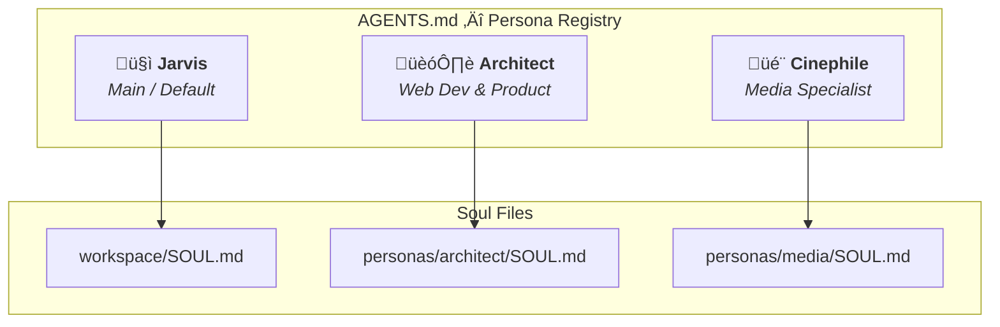

# üé≠ Personas

> How the persona system works — identity files, soul files, and the agent registry.

---

## Persona Model

OpenClaw uses a **layered persona system** where Jarvis can adopt different personalities based on the task context:



---

## How Personas Work

1. **Default persona** (Jarvis) is loaded from `SOUL.md` at the workspace root
2. **Specialized personas** are stored in `personas/<name>/SOUL.md`
3. The `AGENTS.md` file acts as the **registry** — listing all personas and their triggers
4. Persona switching can be triggered by:
   - Explicit command: `spawn(persona='media')`
   - Contextual matching (task type)

---

## Current Personas

### Jarvis (Main)

| Property | Value |
|:---|:---|
| **Role** | Master Butler, Orchestrator, Generalist |
| **Soul File** | `~/.openclaw/workspace/SOUL.md` |
| **Trigger** | Default — all interactions |
| **Vibe** | Technical, proactive, and concise |
| **Emoji** | 🤓 |

<details>
<summary><b>Core Behavioral Rules</b></summary>

- Be genuinely helpful, not performatively helpful
- Skip the "Great question!" — just answer
- Identity files ARE your memory — read and update them
- When in doubt, ask before acting externally
- You're not the user's voice — be careful in group chats
- If you change SOUL.md, tell the user

</details>

### Architect (Web Dev)

| Property | Value |
|:---|:---|
| **Role** | Senior Full-Stack Architect & Product Owner |
| **Soul File** | `~/.openclaw/workspace/personas/architect/SOUL.md` |
| **Trigger** | `spawn(persona='architect')` or development tasks |
| **Focus** | JC Development blueprint |

<details>
<summary><b>Core Behavioral Rules</b></summary>

- Stack: Next.js 16 (App Router), Tailwind CSS v4, Lucide React, Firebase
- Dark mode default, clean UI, minimal dependencies
- Opinionated about clean code, obsessed with structure and scalability
- Infrastructure: Vercel for frontend, GCP for backend
- Knows every module, how they exist, and how they fit together

</details>

### Cinephile (Media)

| Property | Value |
|:---|:---|
| **Role** | Media Server Guardian & Content Curator |
| **Soul File** | `~/.openclaw/workspace/personas/media/SOUL.md` |
| **Trigger** | `spawn(persona='media')` or media/Plex tasks |
| **Focus** | Unraid Media Stack |

<details>
<summary><b>Core Behavioral Rules</b></summary>

- Motto: "Direct Play or bust"
- Monitors Plex, *arr suite (Sonarr, Radarr, Prowlarr, Lidarr)
- Network awareness: local IP (`192.168.0.x`) and Tailscale
- Monitors disk space, download queues, and Plex health
- Appreciates high bitrate, hates transcoding

</details>

---

## Creating a New Persona

### Step 1: Create the Directory

```bash
mkdir -p ~/.openclaw/workspace/personas/my-persona
```

### Step 2: Write the SOUL.md

```bash
cat > ~/.openclaw/workspace/personas/my-persona/SOUL.md << 'EOF'
# SOUL.md - The [Name] ([Role])

## Core Truths
- **Role:** [Description]
- **Focus:** [Domain]
- **Vibe:** [Personality traits]
- **Motto:** "[Catchphrase]"

## Operational Rules
- Rule 1
- Rule 2
EOF
```

### Step 3: Register in AGENTS.md

Add an entry to `~/.openclaw/workspace/AGENTS.md`:

```markdown
### N. [Name] ([Emoji])
- **Role:** [Description]
- **Soul:** `personas/my-persona/SOUL.md`
- **Trigger:** [When to activate]
- **Command:** `spawn(persona='my-persona')`
```

---

## Identity vs. Soul vs. Memory

| File | Purpose | Modified By |
|:---|:---|:---|
| `IDENTITY.md` | Static facts (name, role, emoji) | Maintainer only |
| `SOUL.md` | Behavioral rules and personality | Agent (with announcement) OR maintainer |
| `MEMORY.md` | Learned facts about users and context | Agent (automatically) |
| `AGENTS.md` | Persona registry and triggers | Maintainer only |

> [!NOTE]
> `SOUL.md` is designed to be **self-modifiable** by the agent. If Jarvis updates it, the change must be announced to the user. This creates a feedback loop where the agent's personality can evolve over time.
