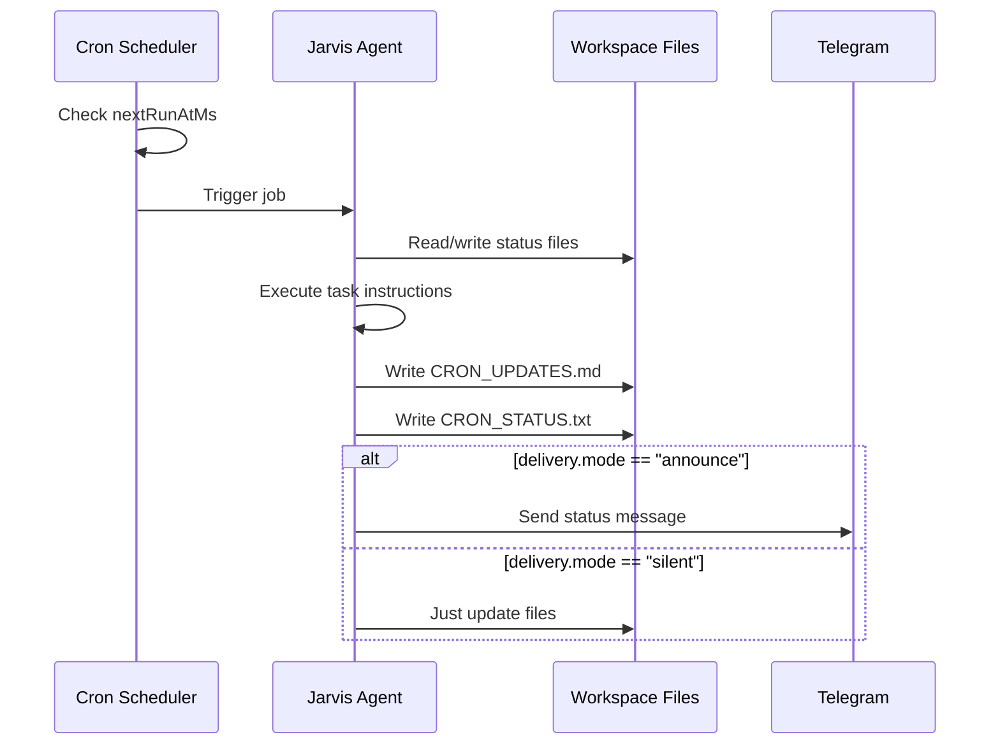

# ⏰ Cron & Automation

> Scheduled jobs, delivery channels, and monitoring automation.

---

## How Cron Works

OpenClaw has a built-in cron system that runs scheduled tasks in the agent's context. Jobs are defined in `~/.openclaw/cron/jobs.json` and executed by the core daemon.



---

## Current Jobs

### Job 1: Hourly Carlos Status Update

| Property | Value |
|:---|:---|
| **ID** | `8253975e-da70-4a24-ac21-3e415eb023d5` |
| **Schedule** | Hourly |
| **Delivery** | `announce` via last-used channel |
| **Status** | ✅ Enabled |

**What it does:**
1. Reads `HEARTBEAT.md` for task checklist
2. Checks system status (FileFlows node, dev server on `192.168.0.140`)
3. Pings homelab server ports (5000 for FileFlows, 3000 for dev server)
4. Appends results to `CRON_UPDATES.md`
5. Writes latest status to `CRON_STATUS.txt`
6. Only messages Carlos if there's something new (Rule #5: respect silence windows)

### Job 2: Daily Reset

| Property | Value |
|:---|:---|
| **Schedule** | Daily |
| **Delivery** | Configurable |
| **Status** | ✅ Enabled |

**What it does:**
1. Syncs development repos
2. Resets daily task state

---

## Job Configuration Format

```json
{
  "version": 1,
  "jobs": [
    {
      "id": "uuid-here",
      "agentId": "main",
      "name": "Human-readable name",
      "enabled": true,
      "createdAtMs": 1772234695077,
      "updatedAtMs": 1774047917390,
      "delivery": {
        "mode": "announce",
        "channel": "last"
      },
      "state": {
        "nextRunAtMs": 1774051405115,
        "lastRunStatus": "ok",
        "lastDeliveryStatus": "not-requested",
        "consecutiveErrors": 0,
        "lastDurationMs": 10179
      }
    }
  ]
}
```

### Delivery Modes

| Mode | Behavior |
|:---|:---|
| `announce` | Send result to the user via messaging |
| `silent` | Execute but don't message |
| `last` | Use the last active messaging channel |

---

## Output Files

| File | Purpose | Location |
|:---|:---|:---|
| `CRON_UPDATES.md` | Append-only log of all cron results with timestamps | Workspace root |
| `CRON_STATUS.txt` | Latest single-run status (1-2 lines) | Workspace root |
| `HEARTBEAT.md` | Task checklist that cron jobs reference | Workspace root |

### Sample CRON_STATUS.txt

```
CRON_UPDATES.md updated.
Server (192.168.0.140) is reachable (ping OK).
Ports 5000 (FileFlows) and 3000 (Dev server) remain closed.
Status unchanged since last check. No message sent (Rule #5).
```

---

## Cron Run Logs

Individual cron executions are logged as `.jsonl` files in `~/.openclaw/cron/runs/`:

```bash
# List recent runs
ls -lt ~/.openclaw/cron/runs/ | head -10

# View a specific run
cat ~/.openclaw/cron/runs/<job-id>.jsonl
```

---

## Maintenance

### Truncating CRON_UPDATES.md

The log grows indefinitely. Periodically trim it:

```bash
# Keep last 100 lines
tail -100 ~/.openclaw/workspace/CRON_UPDATES.md > /tmp/cron_trimmed.md
mv /tmp/cron_trimmed.md ~/.openclaw/workspace/CRON_UPDATES.md
```

### Cleaning Old Run Logs

```bash
# Delete run logs older than 30 days
find ~/.openclaw/cron/runs/ -name "*.jsonl" -mtime +30 -delete
```

### Disabling a Job

Edit `~/.openclaw/cron/jobs.json` and set `"enabled": false`.

> [!WARNING]
> Back up `jobs.json` before editing. OpenClaw validates this file at startup and may reset invalid entries.
