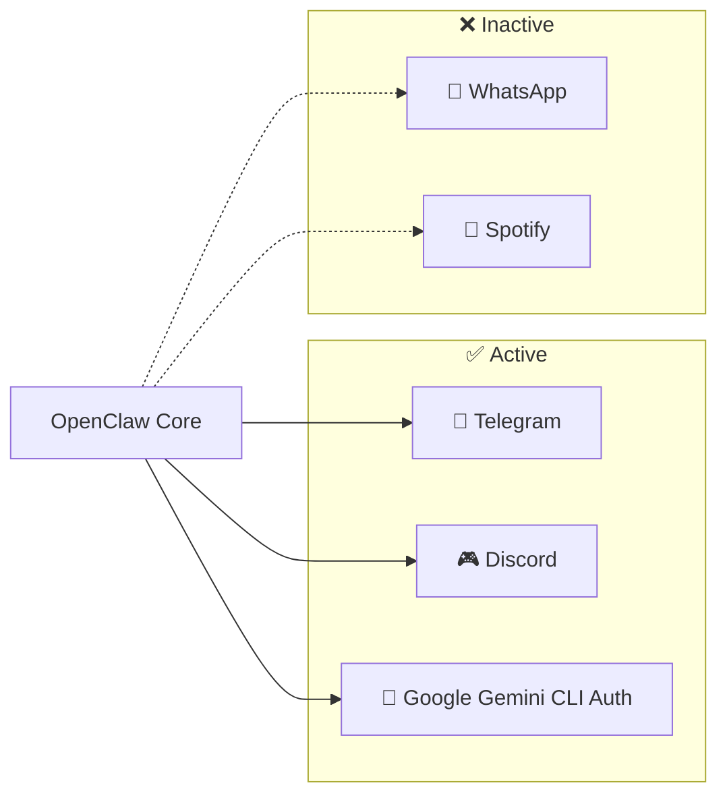

# 🔌 Plugins & Integrations

> Messaging platforms, auth providers, and external service connections.

---

## Plugin Overview



| Plugin | Status | Config Key | Purpose |
|:---|:---|:---|:---|
| **Telegram** | ✅ Enabled | `plugins.entries.telegram` | Primary messaging channel |
| **Discord** | ✅ Enabled | `plugins.entries.discord` | Secondary messaging channel |
| **WhatsApp** | ❌ Disabled | `plugins.entries.whatsapp` | Available, not configured |
| **Google Gemini CLI Auth** | ✅ Enabled | `plugins.entries.google-gemini-cli-auth` | Gemini authentication bridge |
| **Spotify** | ❌ Disabled | `skills.entries.spotify` | Music integration (skill) |

---

## Telegram

The primary communication channel. Jarvis listens for messages and responds via the Telegram Bot API.

### Configuration

| Setting | Location | Value |
|:---|:---|:---|
| Bot Token | `credentials.env` → `TELEGRAM_BOT_TOKEN` | `8517286411:AAE...` |
| State File | `~/.openclaw/telegram/update-offset-default.json` | Tracks last processed update |
| Command Hash | `~/.openclaw/telegram/command-hash-default-*.txt` | Command deduplication |

### Bot Behavior

| Behavior | Setting |
|:---|:---|
| **Reaction Scope** | `group-mentions` — only reacts to @mentions in groups |
| **Message Streaming** | `off` — sends complete responses (not streaming) |
| **Group Policy** | `open` — bot participates in any group it's added to |

### Telegram State Files

```
~/.openclaw/telegram/
├── update-offset-default.json          # Last processed Telegram update ID
└── command-hash-default-*.txt          # Prevents duplicate command processing
```

> [!TIP]
> If Telegram stops responding, check the `update-offset-default.json`. Resetting it to `{}` will reprocess recent messages (may cause duplicates).

---

## Discord

Secondary messaging channel, currently enabled.

### Configuration

| Setting | Location |
|:---|:---|
| Bot Token | `credentials.env` → `DISCORD_TOKEN` |

---

## WhatsApp

Available but not configured. Enable by setting `"enabled": true` in `openclaw.json`.

---

## Google Gemini CLI Auth

Authentication bridge that enables the `google-gemini-cli` model provider. Tokens are managed in `~/.openclaw/agents/main/agent/auth-profiles.json`.

---

## LLM Providers

Not technically "plugins" but configured alongside them. See [Architecture → LLM Provider Chain](architecture.md#llm-provider-chain).

| Provider | Profile Key | API Base |
|:---|:---|:---|
| Google Gemini | `google:default` | Google AI API |
| OpenRouter | `openrouter:default` | `https://openrouter.ai/api/v1` |
| Ollama (local) | N/A | `http://127.0.0.1:11434/v1` |

---

## Browser Automation

OpenClaw includes Playwright browser automation capabilities:

| Setting | Value |
|:---|:---|
| Browser Port | `18800` |
| Chrome Path | `~/.cache/ms-playwright/chromium-1208/chrome-linux64/chrome` |
| Handshake Timeout | `3000ms` |
| Default Timeout | `1500ms` |

---

## External Service Credentials

All credentials are stored in `~/.openclaw/workspace/credentials.env`:

```env
# Channels
TELEGRAM_BOT_TOKEN=<token>
DISCORD_TOKEN=<token>

# Developer
GITHUB_PAT=<token>
GITHUB_USERNAME=jcriecken

# AI
GEMINI_OPENCLAW_API_KEY=<key>
```

> [!CAUTION]
> This file is **gitignored** but exists on disk in plaintext. Ensure file permissions are restrictive:
> ```bash
> chmod 600 ~/.openclaw/workspace/credentials.env
> ```

---

## Enabling / Disabling Plugins

Edit `~/.openclaw/openclaw.json`:

```json
{
  "plugins": {
    "entries": {
      "telegram": {
        "enabled": true    // ← toggle here
      }
    }
  }
}
```

Restart OpenClaw after changes.
